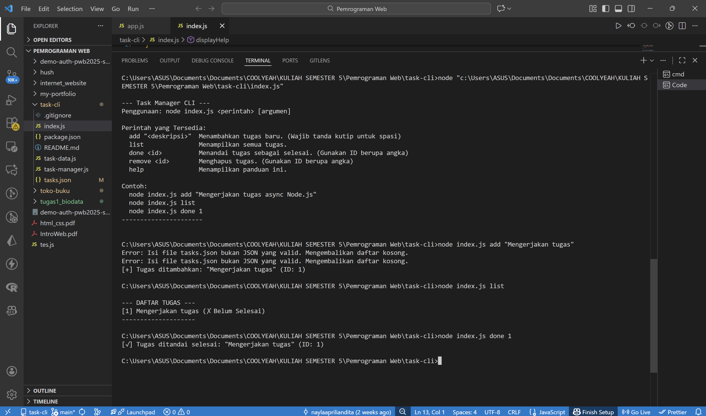

Aplikasi CLI Task Manager Sederhana

Ini adalah tugas minggu 10 yaitu membuat aplikasi task manager berbasis file JSON yang berjalan di command-line.

Fitur:
1. Tambah Tugas: Menambahkan tugas baru ke daftar.
2. Lihat Daftar Tugas: Menampilkan semua tugas dengan status (selesai/belum).
3. Tandai Selesai: Mengubah status tugas menjadi selesai.
4. Hapus Tugas: Menghapus tugas dari daftar.

Teknologi
- Node.js
- fs/promises untuk I/O file asinkron (Async/Await)
- path untuk resolusi path file
- process.argv untuk parsing argumen CLI

